# Product Portal database ERD

> Generated from the PostgreSQL schema produced by the Liquibase master changelog using the production-safe `reference` context. Do not edit the generated sections manually.

## Source and scope

- Source of truth: [Liquibase master changelog](../../src/main/resources/db/changelog/db.changelog-master.yaml)
- Database engine: PostgreSQL 17
- Schema: `public`
- Included objects: application tables matching `pp_%`
- Excluded objects: Liquibase bookkeeping tables, views, functions, triggers, and non-relational indexes
- Tables: 23
- Columns: 288
- Foreign keys: 23
- Unique constraints (excluding primary keys): 20

Key notation: `PK` = primary key, `FK` = foreign key, and `UK` = a column participating in a unique constraint. For composite keys, every participating column carries the marker.

Audit/history tables without database foreign keys are intentionally shown as disconnected. This preserves audit records independently from mutable master data.

## Complete physical ERD

```mermaid
erDiagram
    pp_a_login_attempt {
        BIGINT login_attempt_id PK "NOT NULL"
        VARCHAR_100 username "NOT NULL"
        BIGINT user_id FK "NULL"
        VARCHAR_40 outcome "NOT NULL"
        VARCHAR_45 client_ip "NULL"
        VARCHAR_512 user_agent "NULL"
        TIMESTAMP_6 locked_until "NULL"
        TIMESTAMP_6 occurred_at "NOT NULL"
        TIMESTAMP_6 created_at "NOT NULL"
        VARCHAR_100 created_by "NOT NULL"
    }
    pp_m_brand {
        BIGINT brand_id PK "NOT NULL"
        VARCHAR_150 name UK "NOT NULL"
        VARCHAR_180 slug UK "NOT NULL"
        TEXT description "NULL"
        VARCHAR_500 logo_url "NULL"
        VARCHAR_30 status_code FK "NOT NULL"
        BIGINT version "NOT NULL"
        TIMESTAMP_6 created_at "NOT NULL"
        VARCHAR_100 created_by "NOT NULL"
        TIMESTAMP_6 updated_at "NULL"
        VARCHAR_100 updated_by "NULL"
    }
    pp_m_category {
        BIGINT category_id PK "NOT NULL"
        BIGINT parent_category_id FK "NULL"
        VARCHAR_150 name "NOT NULL"
        VARCHAR_180 slug UK "NOT NULL"
        VARCHAR_30 status_code FK "NOT NULL"
        INTEGER sort_order "NOT NULL"
        BIGINT version "NOT NULL"
        TIMESTAMP_6 created_at "NOT NULL"
        VARCHAR_100 created_by "NOT NULL"
        TIMESTAMP_6 updated_at "NULL"
        VARCHAR_100 updated_by "NULL"
    }
    pp_m_organization {
        BIGINT organization_id PK "NOT NULL"
        VARCHAR_60 organization_code UK "NOT NULL"
        VARCHAR_150 display_name UK "NOT NULL"
        VARCHAR_200 legal_name "NULL"
        VARCHAR_255 description "NULL"
        BOOLEAN is_active "NOT NULL"
        BIGINT version "NOT NULL"
        TIMESTAMP_6 created_at "NOT NULL"
        VARCHAR_100 created_by "NOT NULL"
        TIMESTAMP_6 updated_at "NULL"
        VARCHAR_100 updated_by "NULL"
    }
    pp_m_permission {
        VARCHAR_80 permission_code PK "NOT NULL"
        VARCHAR_150 display_name UK "NOT NULL"
        VARCHAR_255 description "NULL"
        VARCHAR_60 resource_code UK "NOT NULL"
        VARCHAR_60 action_code UK "NOT NULL"
        INTEGER sort_order "NOT NULL"
        BOOLEAN is_active "NOT NULL"
        TIMESTAMP_6 created_at "NOT NULL"
        VARCHAR_100 created_by "NOT NULL"
        TIMESTAMP_6 updated_at "NULL"
        VARCHAR_100 updated_by "NULL"
    }
    pp_m_product {
        BIGINT product_id PK "NOT NULL"
        BIGINT organization_id FK,UK "NOT NULL"
        BIGINT owner_user_id FK "NULL"
        BIGINT category_id FK "NOT NULL"
        BIGINT brand_id FK "NULL"
        VARCHAR_255 name "NOT NULL"
        VARCHAR_300 slug UK "NOT NULL"
        TEXT description "NULL"
        VARCHAR_100 model_number "NULL"
        VARCHAR_100 sku_code UK "NULL"
        VARCHAR_30 status_code FK "NOT NULL"
        BIGINT version "NOT NULL"
        TIMESTAMP_6 created_at "NOT NULL"
        VARCHAR_100 created_by "NOT NULL"
        TIMESTAMP_6 updated_at "NULL"
        VARCHAR_100 updated_by "NULL"
    }
    pp_m_role {
        VARCHAR_30 role_code PK "NOT NULL"
        VARCHAR_100 display_name UK "NOT NULL"
        VARCHAR_255 description "NULL"
        INTEGER sort_order "NOT NULL"
        BOOLEAN is_active "NOT NULL"
        TIMESTAMP_6 created_at "NOT NULL"
        VARCHAR_100 created_by "NOT NULL"
        TIMESTAMP_6 updated_at "NULL"
        VARCHAR_100 updated_by "NULL"
    }
    pp_m_user {
        BIGINT user_id PK "NOT NULL"
        VARCHAR_100 username UK "NOT NULL"
        VARCHAR_150 full_name "NOT NULL"
        VARCHAR_254 email UK "NOT NULL"
        VARCHAR_30 phone_number UK "NULL"
        VARCHAR_255 password_hash "NOT NULL"
        TIMESTAMP_6 credentials_changed_at "NOT NULL"
        VARCHAR_30 status FK "NOT NULL"
        BIGINT primary_organization_id FK "NULL"
        BIGINT version "NOT NULL"
        TIMESTAMP_6 created_at "NOT NULL"
        VARCHAR_100 created_by "NOT NULL"
        TIMESTAMP_6 updated_at "NULL"
        VARCHAR_100 updated_by "NULL"
    }
    pp_m_user_address {
        BIGINT address_id PK "NOT NULL"
        BIGINT user_id FK "NOT NULL"
        VARCHAR_150 recipient_name "NOT NULL"
        VARCHAR_30 phone_number "NOT NULL"
        VARCHAR_255 address_line_1 "NOT NULL"
        VARCHAR_255 address_line_2 "NULL"
        VARCHAR_100 city "NOT NULL"
        VARCHAR_100 district "NULL"
        VARCHAR_100 province "NULL"
        VARCHAR_20 postal_code "NULL"
        VARCHAR_100 country "NOT NULL"
        BOOLEAN is_default "NOT NULL"
        BIGINT version "NOT NULL"
        TIMESTAMP_6 created_at "NOT NULL"
        VARCHAR_100 created_by "NOT NULL"
        TIMESTAMP_6 updated_at "NULL"
        VARCHAR_100 updated_by "NULL"
    }
    pp_r_brand_status {
        VARCHAR_30 status_code PK "NOT NULL"
        VARCHAR_100 display_name UK "NOT NULL"
        VARCHAR_255 description "NULL"
        INTEGER sort_order "NOT NULL"
        BOOLEAN is_active "NOT NULL"
        TIMESTAMP_6 created_at "NOT NULL"
        VARCHAR_100 created_by "NOT NULL"
        TIMESTAMP_6 updated_at "NULL"
        VARCHAR_100 updated_by "NULL"
    }
    pp_r_category_status {
        VARCHAR_30 status_code PK "NOT NULL"
        VARCHAR_100 display_name UK "NOT NULL"
        VARCHAR_255 description "NULL"
        INTEGER sort_order "NOT NULL"
        BOOLEAN is_active "NOT NULL"
        TIMESTAMP_6 created_at "NOT NULL"
        VARCHAR_100 created_by "NOT NULL"
        TIMESTAMP_6 updated_at "NULL"
        VARCHAR_100 updated_by "NULL"
    }
    pp_r_membership_status {
        VARCHAR_30 status_code PK "NOT NULL"
        VARCHAR_100 display_name UK "NOT NULL"
        VARCHAR_255 description "NULL"
        INTEGER sort_order "NOT NULL"
        BOOLEAN is_active "NOT NULL"
        TIMESTAMP_6 created_at "NOT NULL"
        VARCHAR_100 created_by "NOT NULL"
        TIMESTAMP_6 updated_at "NULL"
        VARCHAR_100 updated_by "NULL"
    }
    pp_r_permission_scope {
        VARCHAR_30 scope_code PK "NOT NULL"
        VARCHAR_100 display_name UK "NOT NULL"
        VARCHAR_255 description "NULL"
        INTEGER sort_order "NOT NULL"
        BOOLEAN is_active "NOT NULL"
        TIMESTAMP_6 created_at "NOT NULL"
        VARCHAR_100 created_by "NOT NULL"
        TIMESTAMP_6 updated_at "NULL"
        VARCHAR_100 updated_by "NULL"
    }
    pp_r_product_status {
        VARCHAR_30 status_code PK "NOT NULL"
        VARCHAR_100 display_name UK "NOT NULL"
        VARCHAR_255 description "NULL"
        INTEGER sort_order "NOT NULL"
        BOOLEAN is_active "NOT NULL"
        TIMESTAMP_6 created_at "NOT NULL"
        VARCHAR_100 created_by "NOT NULL"
        TIMESTAMP_6 updated_at "NULL"
        VARCHAR_100 updated_by "NULL"
    }
    pp_r_user_status {
        VARCHAR_30 status_code PK "NOT NULL"
        VARCHAR_100 display_name UK "NOT NULL"
        VARCHAR_255 description "NULL"
        INTEGER sort_order "NOT NULL"
        BOOLEAN is_active "NOT NULL"
        TIMESTAMP_6 created_at "NOT NULL"
        VARCHAR_100 created_by "NOT NULL"
        TIMESTAMP_6 updated_at "NULL"
        VARCHAR_100 updated_by "NULL"
    }
    pp_t_auth_session {
        CHAR_36 auth_session_id PK "NOT NULL"
        BIGINT user_id FK "NOT NULL"
        VARCHAR_64 refresh_token_hash "NOT NULL"
        TIMESTAMP_6 issued_at "NOT NULL"
        TIMESTAMP_6 refresh_expires_at "NOT NULL"
        TIMESTAMP_6 last_used_at "NOT NULL"
        TIMESTAMP_6 revoked_at "NULL"
        VARCHAR_60 revocation_reason "NULL"
        VARCHAR_45 client_ip "NULL"
        VARCHAR_512 user_agent "NULL"
        BIGINT version "NOT NULL"
        TIMESTAMP_6 created_at "NOT NULL"
        VARCHAR_100 created_by "NOT NULL"
        TIMESTAMP_6 updated_at "NULL"
        VARCHAR_100 updated_by "NULL"
    }
    pp_t_login_throttle_state {
        BIGINT throttle_state_id PK "NOT NULL"
        VARCHAR_30 scope UK "NOT NULL"
        VARCHAR_255 identifier_value UK "NOT NULL"
        INTEGER failed_attempt_count "NOT NULL"
        TIMESTAMP_6 window_started_at "NULL"
        TIMESTAMP_6 last_failed_at "NULL"
        TIMESTAMP_6 locked_until "NULL"
        TIMESTAMP_6 last_successful_at "NULL"
        BIGINT version "NOT NULL"
        TIMESTAMP_6 created_at "NOT NULL"
        VARCHAR_100 created_by "NOT NULL"
        TIMESTAMP_6 updated_at "NULL"
        VARCHAR_100 updated_by "NULL"
    }
    pp_t_role_permission_grant {
        VARCHAR_30 role_code PK,FK "NOT NULL"
        VARCHAR_80 permission_code PK,FK "NOT NULL"
        VARCHAR_30 scope_code FK "NOT NULL"
        BOOLEAN is_active "NOT NULL"
        VARCHAR_100 assigned_by "NOT NULL"
        VARCHAR_255 assigned_reason "NULL"
        VARCHAR_100 revoked_by "NULL"
        VARCHAR_255 revoked_reason "NULL"
        TIMESTAMP_6 created_at "NOT NULL"
        VARCHAR_100 created_by "NOT NULL"
        TIMESTAMP_6 updated_at "NULL"
        VARCHAR_100 updated_by "NULL"
    }
    pp_t_role_permission_grant_audit {
        BIGINT audit_id PK "NOT NULL"
        VARCHAR_30 role_code "NOT NULL"
        VARCHAR_80 permission_code "NOT NULL"
        VARCHAR_30 event_type "NOT NULL"
        BOOLEAN previous_active "NULL"
        BOOLEAN new_active "NULL"
        VARCHAR_30 previous_scope_code "NULL"
        VARCHAR_30 new_scope_code "NULL"
        VARCHAR_100 assigned_by "NULL"
        VARCHAR_255 assigned_reason "NULL"
        VARCHAR_100 revoked_by "NULL"
        VARCHAR_255 revoked_reason "NULL"
        TIMESTAMP_6 changed_at "NOT NULL"
        VARCHAR_100 changed_by "NOT NULL"
        VARCHAR_100 database_user "NOT NULL"
        VARCHAR_30 source_code "NOT NULL"
        VARCHAR_255 change_reason "NULL"
        VARCHAR_100 correlation_id "NULL"
    }
    pp_t_user_organization_membership {
        BIGINT user_id PK,FK "NOT NULL"
        BIGINT organization_id PK,FK "NOT NULL"
        VARCHAR_30 membership_status FK "NOT NULL"
        BOOLEAN is_primary "NOT NULL"
        TIMESTAMP_6 joined_at "NULL"
        VARCHAR_100 invited_by "NULL"
        TIMESTAMP_6 invited_at "NULL"
        TIMESTAMP_6 created_at "NOT NULL"
        VARCHAR_100 created_by "NOT NULL"
        TIMESTAMP_6 updated_at "NULL"
        VARCHAR_100 updated_by "NULL"
    }
    pp_t_user_organization_membership_audit {
        BIGINT audit_id PK "NOT NULL"
        BIGINT user_id "NOT NULL"
        BIGINT organization_id "NOT NULL"
        VARCHAR_30 event_type "NOT NULL"
        VARCHAR_30 previous_membership_status "NULL"
        VARCHAR_30 new_membership_status "NULL"
        BOOLEAN previous_primary "NULL"
        BOOLEAN new_primary "NULL"
        TIMESTAMP_6 previous_joined_at "NULL"
        TIMESTAMP_6 new_joined_at "NULL"
        VARCHAR_100 previous_invited_by "NULL"
        VARCHAR_100 new_invited_by "NULL"
        TIMESTAMP_6 previous_invited_at "NULL"
        TIMESTAMP_6 new_invited_at "NULL"
        TIMESTAMP_6 changed_at "NOT NULL"
        VARCHAR_100 changed_by "NOT NULL"
        VARCHAR_100 database_user "NOT NULL"
        VARCHAR_30 source_code "NOT NULL"
        VARCHAR_255 change_reason "NULL"
        VARCHAR_100 correlation_id "NULL"
    }
    pp_t_user_role_assignment {
        BIGINT user_id PK,FK "NOT NULL"
        BIGINT organization_id PK,FK "NOT NULL"
        VARCHAR_30 role_code PK,FK "NOT NULL"
        BOOLEAN is_active "NOT NULL"
        TIMESTAMP_6 valid_from "NULL"
        TIMESTAMP_6 valid_until "NULL"
        VARCHAR_100 assigned_by "NOT NULL"
        VARCHAR_255 assigned_reason "NULL"
        VARCHAR_100 revoked_by "NULL"
        VARCHAR_255 revoked_reason "NULL"
        TIMESTAMP_6 created_at "NOT NULL"
        VARCHAR_100 created_by "NOT NULL"
        TIMESTAMP_6 updated_at "NULL"
        VARCHAR_100 updated_by "NULL"
    }
    pp_t_user_role_assignment_audit {
        BIGINT audit_id PK "NOT NULL"
        BIGINT user_id "NOT NULL"
        BIGINT organization_id "NOT NULL"
        VARCHAR_30 role_code "NOT NULL"
        VARCHAR_30 event_type "NOT NULL"
        BOOLEAN previous_active "NULL"
        BOOLEAN new_active "NULL"
        TIMESTAMP_6 previous_valid_from "NULL"
        TIMESTAMP_6 previous_valid_until "NULL"
        TIMESTAMP_6 new_valid_from "NULL"
        TIMESTAMP_6 new_valid_until "NULL"
        VARCHAR_100 assigned_by "NULL"
        VARCHAR_255 assigned_reason "NULL"
        VARCHAR_100 revoked_by "NULL"
        VARCHAR_255 revoked_reason "NULL"
        TIMESTAMP_6 changed_at "NOT NULL"
        VARCHAR_100 changed_by "NOT NULL"
        VARCHAR_100 database_user "NOT NULL"
        VARCHAR_30 source_code "NOT NULL"
        VARCHAR_255 change_reason "NULL"
        VARCHAR_100 correlation_id "NULL"
    }
    pp_m_user o|--o{ pp_a_login_attempt : "fk_pp_a_login_attempt_user"
    pp_r_brand_status ||--o{ pp_m_brand : "fk_pp_m_brand_status"
    pp_m_category o|--o{ pp_m_category : "fk_pp_m_category_parent"
    pp_r_category_status ||--o{ pp_m_category : "fk_pp_m_category_status"
    pp_m_brand o|--o{ pp_m_product : "fk_pp_m_product_brand"
    pp_m_category ||--o{ pp_m_product : "fk_pp_m_product_category"
    pp_m_organization ||--o{ pp_m_product : "fk_pp_m_product_organization"
    pp_m_user o|--o{ pp_m_product : "fk_pp_m_product_owner_user"
    pp_r_product_status ||--o{ pp_m_product : "fk_pp_m_product_status"
    pp_m_organization o|--o{ pp_m_user : "fk_pp_m_user_primary_organization"
    pp_r_user_status ||--o{ pp_m_user : "fk_pp_m_user_status"
    pp_m_user ||--o{ pp_m_user_address : "fk_pp_m_user_address_user"
    pp_m_user ||--o{ pp_t_auth_session : "fk_pp_t_auth_session_user"
    pp_m_permission ||--o{ pp_t_role_permission_grant : "fk_pp_t_role_permission_grant_permission"
    pp_m_role ||--o{ pp_t_role_permission_grant : "fk_pp_t_role_permission_grant_role"
    pp_r_permission_scope ||--o{ pp_t_role_permission_grant : "fk_pp_t_role_permission_grant_scope"
    pp_m_organization ||--o{ pp_t_user_organization_membership : "fk_pp_t_user_organization_membership_organization"
    pp_r_membership_status ||--o{ pp_t_user_organization_membership : "fk_pp_t_user_organization_membership_status"
    pp_m_user ||--o{ pp_t_user_organization_membership : "fk_pp_t_user_organization_membership_user"
    pp_t_user_organization_membership ||--o{ pp_t_user_role_assignment : "fk_pp_t_user_role_assignment_membership"
    pp_m_organization ||--o{ pp_t_user_role_assignment : "fk_pp_t_user_role_assignment_organization"
    pp_m_role ||--o{ pp_t_user_role_assignment : "fk_pp_t_user_role_assignment_role"
    pp_m_user ||--o{ pp_t_user_role_assignment : "fk_pp_t_user_role_assignment_user"
```



## Foreign-key relationship catalog

| Constraint | Child columns | Parent columns | Parent required | Child multiplicity | On update | On delete |
|---|---|---|---|---|---|---|
| `fk_pp_a_login_attempt_user` | `pp_a_login_attempt.user_id` | `pp_m_user.user_id` | No | Zero or many | NO ACTION | SET NULL |
| `fk_pp_m_brand_status` | `pp_m_brand.status_code` | `pp_r_brand_status.status_code` | Yes | Zero or many | NO ACTION | NO ACTION |
| `fk_pp_m_category_parent` | `pp_m_category.parent_category_id` | `pp_m_category.category_id` | No | Zero or many | NO ACTION | NO ACTION |
| `fk_pp_m_category_status` | `pp_m_category.status_code` | `pp_r_category_status.status_code` | Yes | Zero or many | NO ACTION | NO ACTION |
| `fk_pp_m_product_brand` | `pp_m_product.brand_id` | `pp_m_brand.brand_id` | No | Zero or many | NO ACTION | NO ACTION |
| `fk_pp_m_product_category` | `pp_m_product.category_id` | `pp_m_category.category_id` | Yes | Zero or many | NO ACTION | NO ACTION |
| `fk_pp_m_product_organization` | `pp_m_product.organization_id` | `pp_m_organization.organization_id` | Yes | Zero or many | NO ACTION | NO ACTION |
| `fk_pp_m_product_owner_user` | `pp_m_product.owner_user_id` | `pp_m_user.user_id` | No | Zero or many | NO ACTION | SET NULL |
| `fk_pp_m_product_status` | `pp_m_product.status_code` | `pp_r_product_status.status_code` | Yes | Zero or many | NO ACTION | NO ACTION |
| `fk_pp_m_user_primary_organization` | `pp_m_user.primary_organization_id` | `pp_m_organization.organization_id` | No | Zero or many | NO ACTION | SET NULL |
| `fk_pp_m_user_status` | `pp_m_user.status` | `pp_r_user_status.status_code` | Yes | Zero or many | NO ACTION | NO ACTION |
| `fk_pp_m_user_address_user` | `pp_m_user_address.user_id` | `pp_m_user.user_id` | Yes | Zero or many | NO ACTION | CASCADE |
| `fk_pp_t_auth_session_user` | `pp_t_auth_session.user_id` | `pp_m_user.user_id` | Yes | Zero or many | NO ACTION | CASCADE |
| `fk_pp_t_role_permission_grant_permission` | `pp_t_role_permission_grant.permission_code` | `pp_m_permission.permission_code` | Yes | Zero or many | NO ACTION | NO ACTION |
| `fk_pp_t_role_permission_grant_role` | `pp_t_role_permission_grant.role_code` | `pp_m_role.role_code` | Yes | Zero or many | NO ACTION | NO ACTION |
| `fk_pp_t_role_permission_grant_scope` | `pp_t_role_permission_grant.scope_code` | `pp_r_permission_scope.scope_code` | Yes | Zero or many | NO ACTION | NO ACTION |
| `fk_pp_t_user_organization_membership_organization` | `pp_t_user_organization_membership.organization_id` | `pp_m_organization.organization_id` | Yes | Zero or many | NO ACTION | NO ACTION |
| `fk_pp_t_user_organization_membership_status` | `pp_t_user_organization_membership.membership_status` | `pp_r_membership_status.status_code` | Yes | Zero or many | NO ACTION | NO ACTION |
| `fk_pp_t_user_organization_membership_user` | `pp_t_user_organization_membership.user_id` | `pp_m_user.user_id` | Yes | Zero or many | NO ACTION | CASCADE |
| `fk_pp_t_user_role_assignment_membership` | `pp_t_user_role_assignment.user_id, pp_t_user_role_assignment.organization_id` | `pp_t_user_organization_membership.user_id, pp_t_user_organization_membership.organization_id` | Yes | Zero or many | NO ACTION | NO ACTION |
| `fk_pp_t_user_role_assignment_organization` | `pp_t_user_role_assignment.organization_id` | `pp_m_organization.organization_id` | Yes | Zero or many | NO ACTION | NO ACTION |
| `fk_pp_t_user_role_assignment_role` | `pp_t_user_role_assignment.role_code` | `pp_m_role.role_code` | Yes | Zero or many | NO ACTION | NO ACTION |
| `fk_pp_t_user_role_assignment_user` | `pp_t_user_role_assignment.user_id` | `pp_m_user.user_id` | Yes | Zero or many | NO ACTION | CASCADE |

## Unique-constraint catalog

Primary keys are already marked in the ERD and are omitted from this catalog.

| Constraint | Table | Columns |
|---|---|---|
| `uk_pp_m_brand_name` | `pp_m_brand` | `name` |
| `uk_pp_m_brand_slug` | `pp_m_brand` | `slug` |
| `uk_pp_m_category_slug` | `pp_m_category` | `slug` |
| `uk_pp_m_organization_code` | `pp_m_organization` | `organization_code` |
| `uk_pp_m_organization_display_name` | `pp_m_organization` | `display_name` |
| `uk_pp_m_permission_display_name` | `pp_m_permission` | `display_name` |
| `uk_pp_m_permission_resource_action` | `pp_m_permission` | `resource_code, action_code` |
| `uk_pp_m_product_org_sku_code` | `pp_m_product` | `organization_id, sku_code` |
| `uk_pp_m_product_org_slug` | `pp_m_product` | `organization_id, slug` |
| `uk_pp_m_role_display_name` | `pp_m_role` | `display_name` |
| `uk_pp_m_user_email` | `pp_m_user` | `email` |
| `uk_pp_m_user_phone_number` | `pp_m_user` | `phone_number` |
| `uk_pp_m_user_username` | `pp_m_user` | `username` |
| `uk_pp_r_brand_status_display_name` | `pp_r_brand_status` | `display_name` |
| `uk_pp_r_category_status_display_name` | `pp_r_category_status` | `display_name` |
| `uk_pp_r_membership_status_display_name` | `pp_r_membership_status` | `display_name` |
| `uk_pp_r_permission_scope_display_name` | `pp_r_permission_scope` | `display_name` |
| `uk_pp_r_product_status_display_name` | `pp_r_product_status` | `display_name` |
| `uk_pp_r_user_status_display_name` | `pp_r_user_status` | `display_name` |
| `uk_pp_t_login_throttle_state_scope_identifier` | `pp_t_login_throttle_state` | `scope, identifier_value` |

## Regeneration

After adding a Liquibase schema migration, regenerate this file from the migrated database:

```powershell
.\mvnw.cmd "-Dtest=DatabaseErDiagramDocumentationTest" "-Derd.write=true" test
```

```bash
./mvnw -Dtest=DatabaseErDiagramDocumentationTest -Derd.write=true test
```

A normal `mvn test` regenerates the expected content in memory and fails if this committed document is stale.
